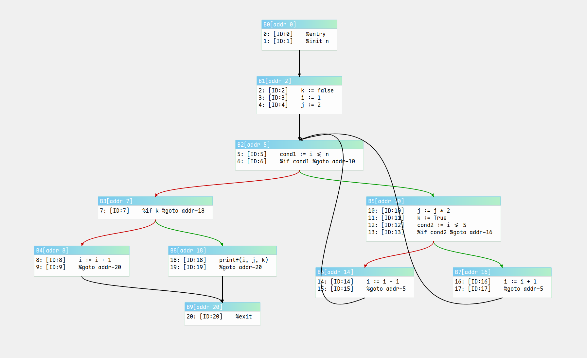
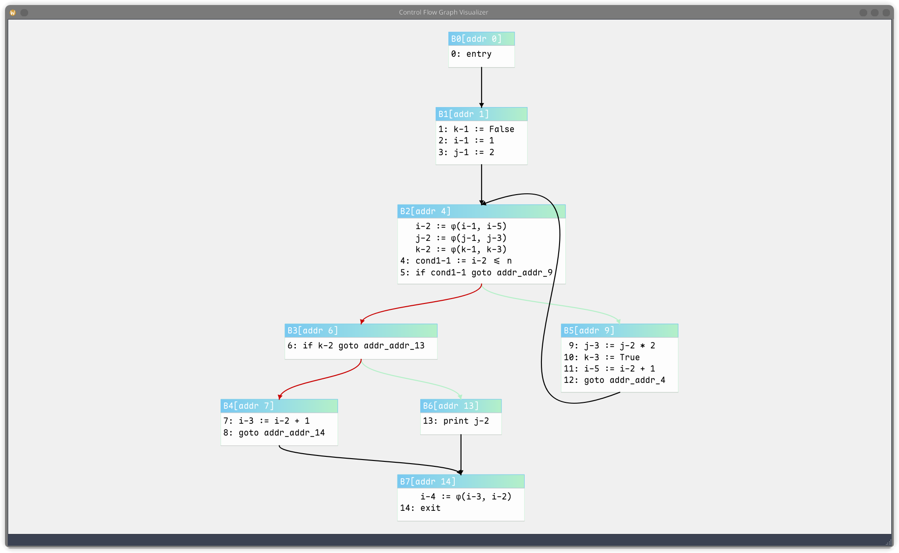
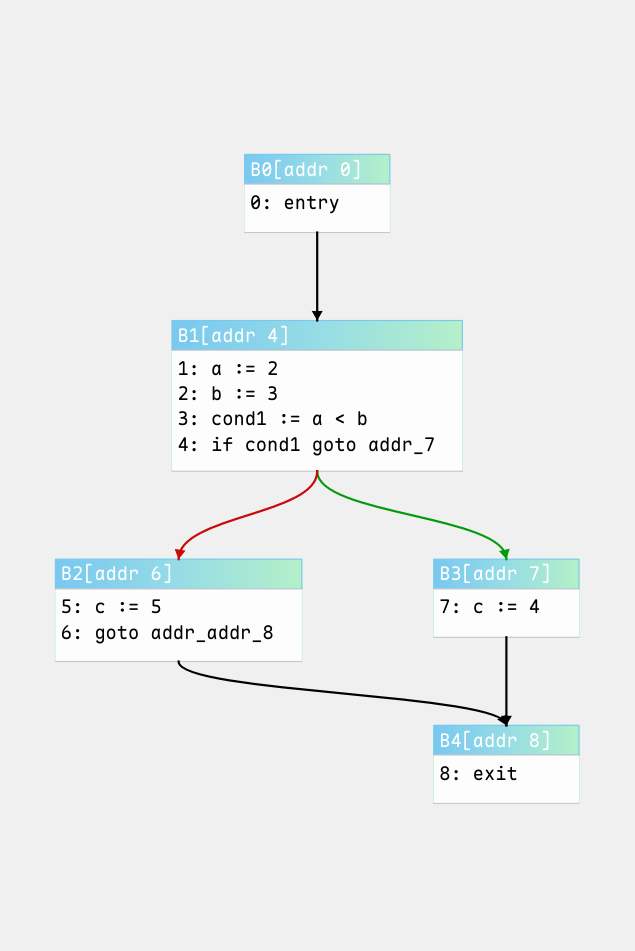
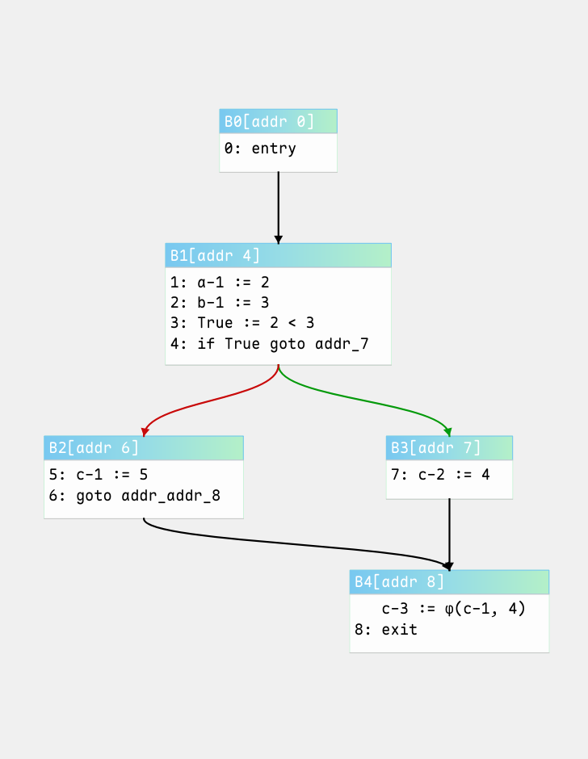

# Code Optimization Framework

***

## 介绍

Python实现的程序分析框架，可作为编译器后端。正在开发中。

***

## 演示

### MIR to CFG

自定义MIR语法

```
# test/ssa_example.ir

    entry
    k := false
    i := 1
    j := 2
L1:
    cond1 := i <= n
    if cond1 goto &L2
    if k goto &L3
    i := i + 1
    goto &L4
L2:
    j := j * 2
    k := true
    i := i + 1
    goto &L1
L3:
    print j
L4:
    exit
```

可视化控制流图展示



最小化SSA计算展示



### 常量折叠

MIR示例源码

```
    entry
    a := 2
    b := 3
    cond1 := a < b
    if cond1 goto &L1
    c := 5
    goto &L2
L1:
    c := 4
L2:
    exit
```

| Before                                               | After                                                                                 |
| ---------------------------------------------------- | ------------------------------------------------------------------------------------- |
| Before | After |

## TODO

- [x] 数据流分析框架
- [x] 最小化SSA计算
- [x] 稀有条件常量传播(符号执行)
- [x] 常量折叠
- [ ] 死代码消除
- [ ] 高级数据流分析
- [ ] 控制树规约

## License

无